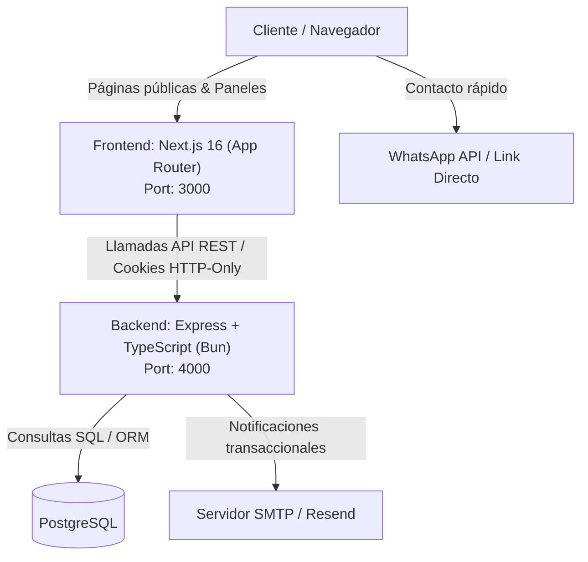
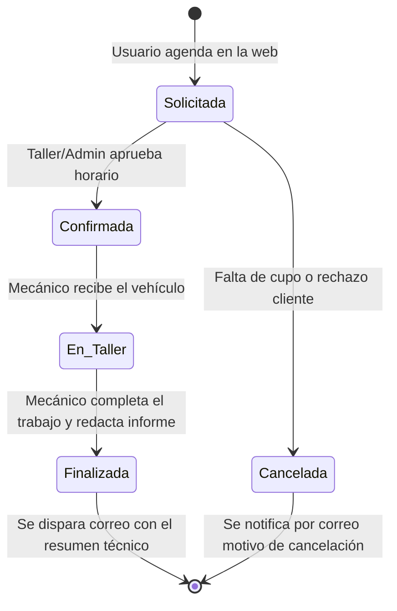

# Arquitectura del Sistema - Grúas Cares

Este documento describe la arquitectura global, patrones de diseño y flujo de datos para la plataforma web y sistema de gestión de Grúas Cares.

---

## 1. Visión General de la Solución

El sistema se compone de dos capas desacopladas sobre el runtime **Bun**:

---

## 2. Capas del Sistema

### 2.1. Frontend (Next.js 16)
- **Localización**: Raíz del proyecto (`/app`, `/public`, etc.).
- **Responsabilidad**: Presentación de la web corporativa, catálogo visual, agenda pública y los 3 portales/paneles (`/portal`, `/mecanico`, `/admin`).
- **Navegación & Seguridad**:
  - Middleware de Next.js para inspección de sesión y redirección por rol antes de renderizar la página.
  - Contexto de autenticación en React (`AuthContext`) para actualizar estado en el cliente.
- **Estilos**: Sistema de diseño basado en la identidad oficial en `app/globals.css`.

### 2.2. Backend (Express + TypeScript)
- **Localización**: `/backend`.
- **Runtime**: Bun (máximo rendimiento y compatibilidad nativa con TypeScript sin necesidad de transpilación lenta).
- **Patrón de Arquitectura**: Capas (Controller -> Service -> Repository/ORM).
- **Seguridad**:
  - Helmet para cabeceras HTTP seguras.
  - CORS configurado exclusivamente para el dominio del frontend.
  - Rate limiting en rutas de autenticación (`/api/auth/*`).
  - Passwords hasheadas con `bcrypt`.
  - Tokens JWT firmados o sesiones persistidas en cookies `httpOnly`, `SameSite=Lax`, `Secure`.

### 2.3. Base de Datos (PostgreSQL)
- **Modelos Principales**:
  - **`users`**: Administradores, mecánicos y clientes.
  - **`vehicles`**: Vehículos asociados a clientes (patente, marca, modelo, año, kilometraje).
  - **`services`**: Catálogo de servicios ofrecidos (grúa de rescate, cambio de aceite, mantención preventiva, etc.).
  - **`appointments`**: Citas y solicitudes con fechas, bloques horarios, estado del flujo y mecánico asignado.
  - **`service_records`**: Bitácora técnica post-atención (informe técnico, repuestos cambiados, recomendaciones).

---

## 3. Flujo de Estados de una Cita en Serviteca

---

## 4. Política de Notificaciones
- **Notificaciones operativas y transaccionales**: Se realizan exclusivamente vía **correo electrónico** (creación de cuenta, confirmación de cita, cambio de estado, resumen de atención técnica).
- **Contacto comercial / emergencias inmediatas**: Se canaliza a través del **botón flotante de WhatsApp** en el frontend público para comunicación humana inmediata.
